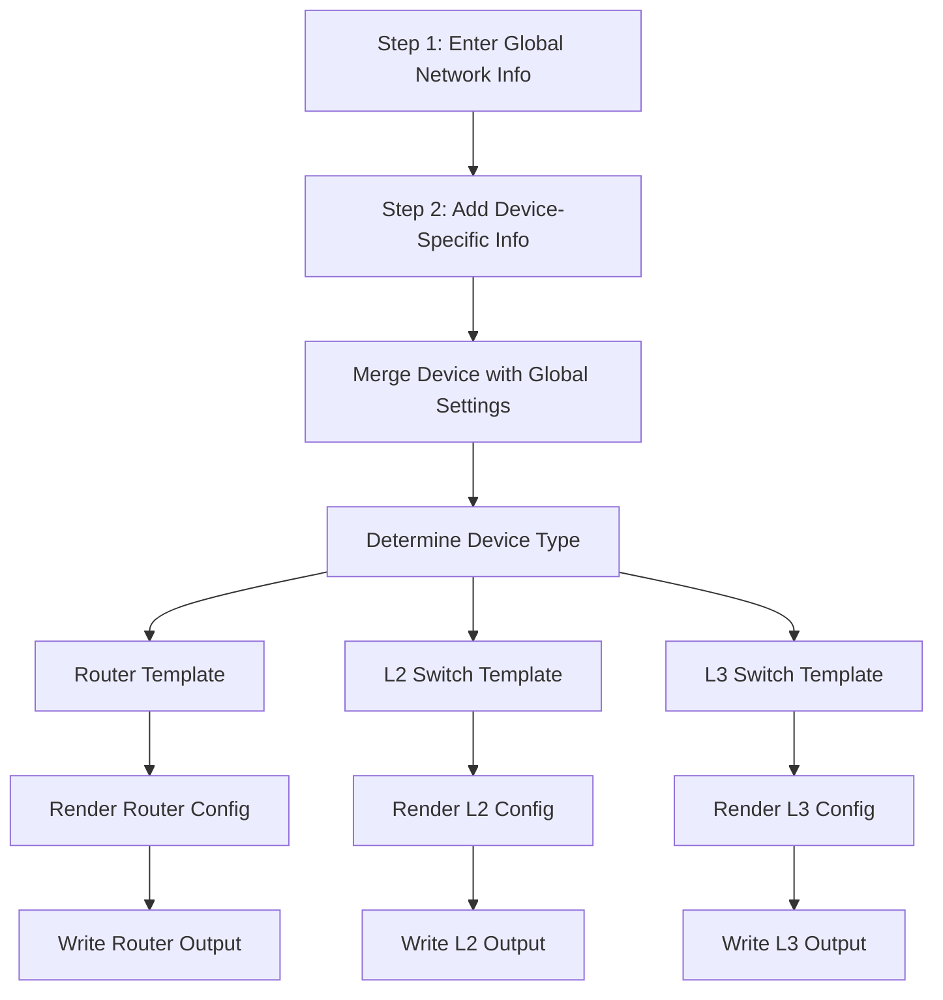

# Execution Flow

This note describes the lifecycle of the config generation process — from parsing the input to rendering and outputting final configuration files.

---

##  Overview

1. **User provides input file**
   - A YAML file containing global settings and device configurations

2. **System loads input**
   - Parsed by `input_loader.py`
   - Split into `global_config` and `devices[]`

3. **Device loop begins**
   - For each device in the list:
     - Run merge logic via `config_merger.py`
     - Inherit global fields where applicable

4. **Template selection**
   - Based on `device_type` (router, l2_switch, etc.)
   - Select matching Jinja2 template

5. **Template rendering**
   - Render the config using `generator.py`
   - Output as plain text file to `/outputs/`

---
##  Flow Diagram (Conceptual)

---

###  Key Points Reflected:
- Shows user **filling out input in 2 stages**
- Emphasizes **merging** as a separate, essential step
- Cleanly branches based on device type
- Unified output generation per device

---

